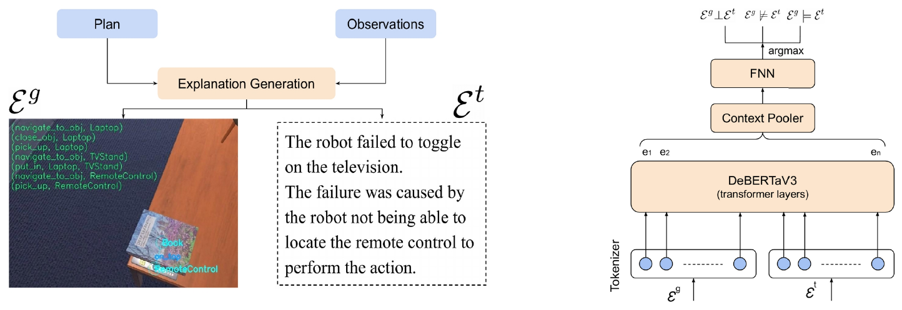

# coexp-iros24
This repository contains code & data for the paper Multimodal Coherent Explanation Generation of Robot Failures, IROS 2024.

# Setup
Coming soon!

# Experiments
Please follow these steps to make the train-validation-test splits and fine-tune the NLI models for coherence classification.

1. Run `make_splits.py` to reproduce the splits from combining the RoboFail and the CounterFactual datasets, as explained in the paper.
2. To run evaluation on only-NLI baselines, run `eval_RoBERTa-large-MNLI.py` and `eval_DeBERTa-v3-base-NLI.py` inside eval_scripts.
3. Fine-tuning (coming soon...)
